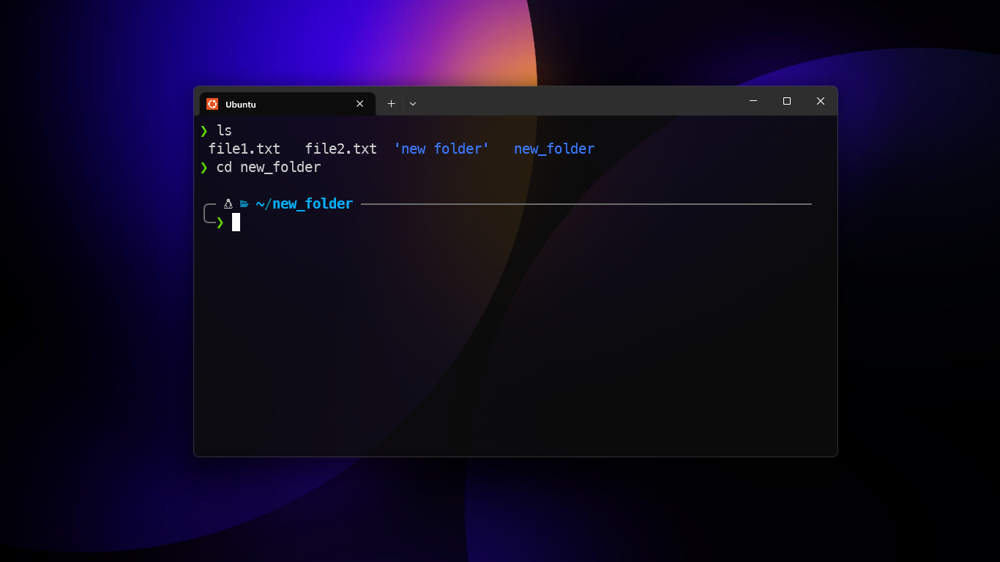
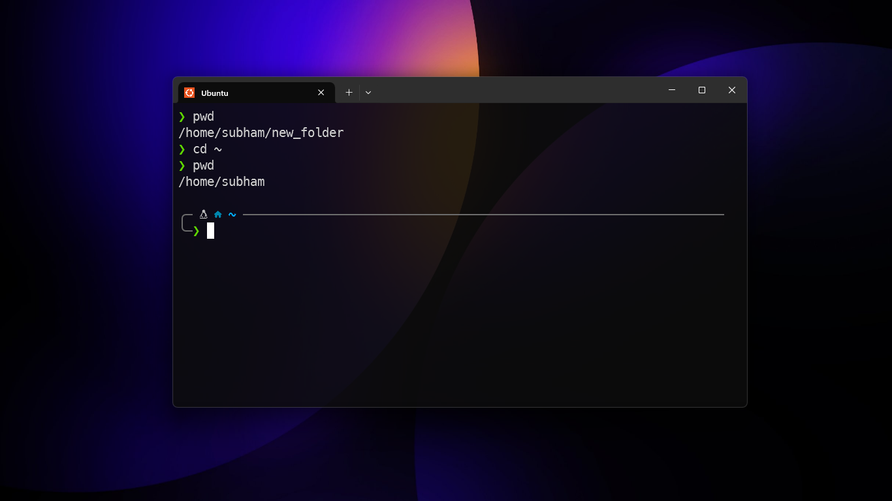
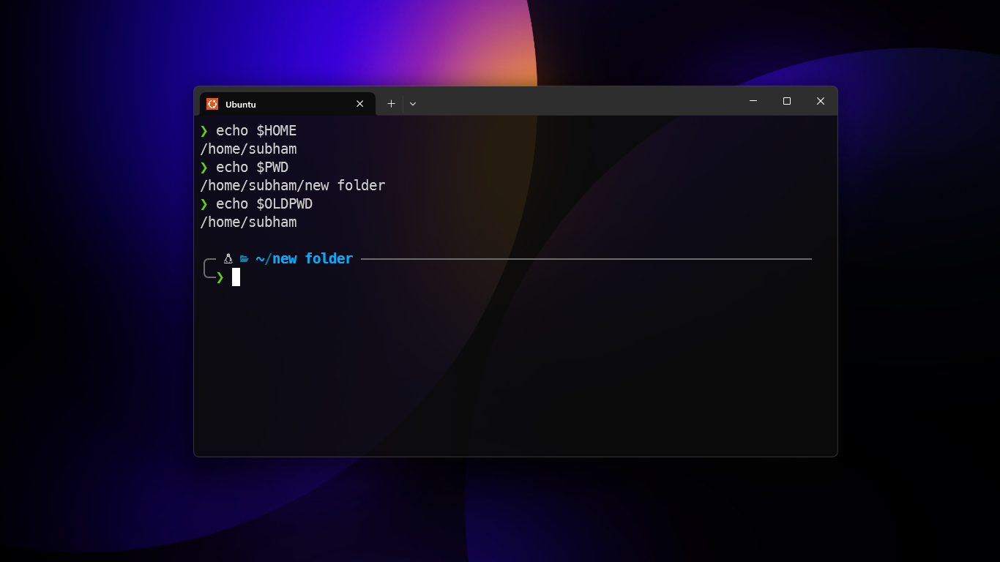

# cd
- it stands for change directory
- it is used to change the current working directory in the shell.
- usage:
    - `cd directory_location` : changes the current working directory to ***directory_location***
    - `cd ~` or `cd` : changes the current working directory to ***home directory***
    - `cd ..` : changes the current working directory to ***parent directory***
    - `cd .` : changes the current working directory to ***current directory***
- handle spaces in directory name :
    - `cd "My Folder"`
    - `cd My\ Folder`
- Environment variables related to `cd` :
    - `$HOME` : home directory
    - `$PWD` : current directory
    - `$OLDPWD` : previous directory

fig: example of `cd new_folder`

fig: example of `cd ~`

fig: example of `cd `

fig: example of `cd new\ folder`

fig: example of `cd "new folder"`

fig: showing values of  `$HOME`, `$PWD`, `$OLDPWD`
