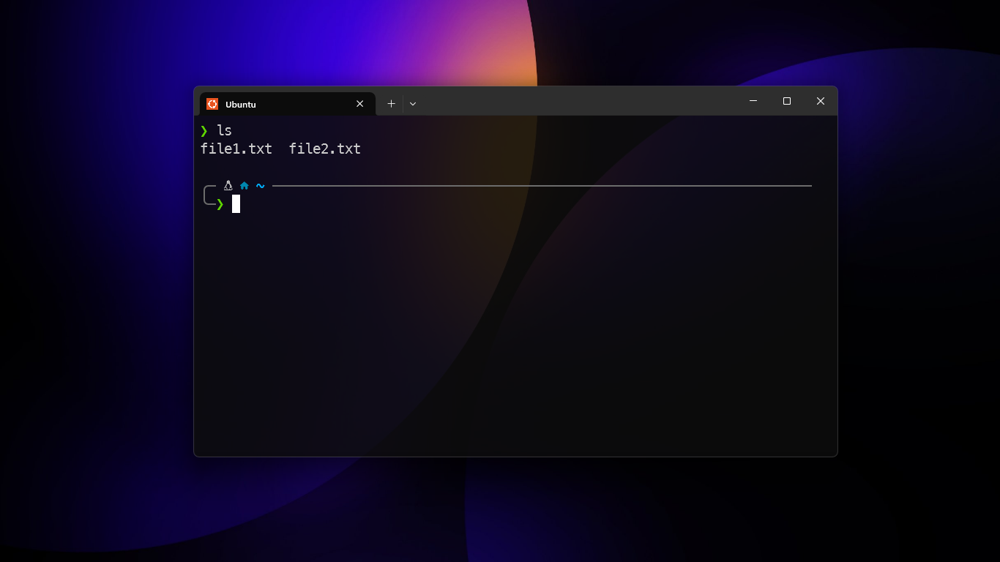
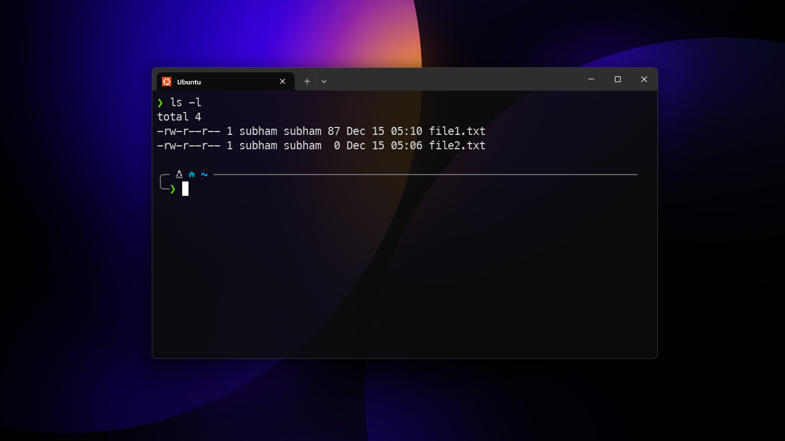
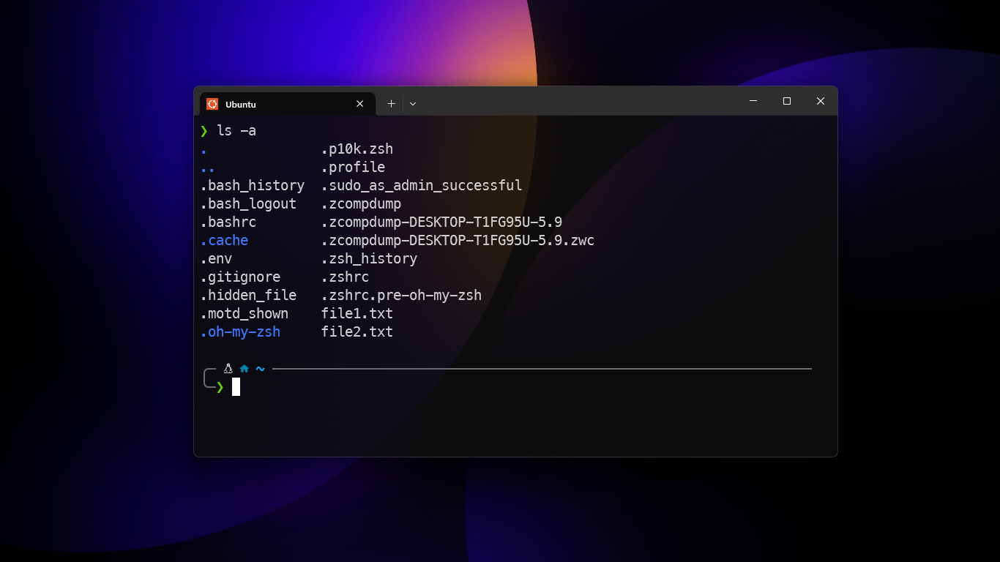
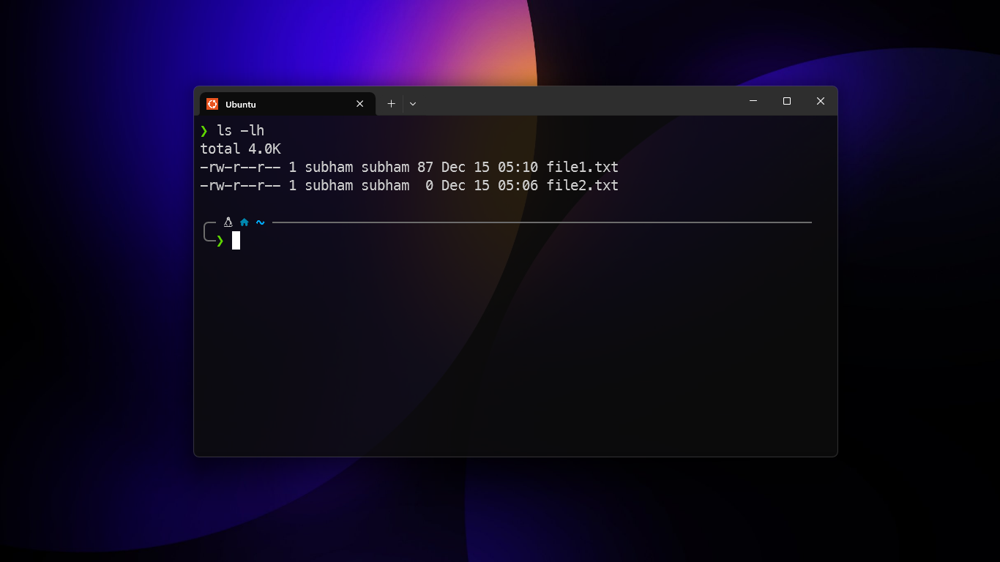

# ls
- it stands for list storage
- this command is used to list the files and folder in the current working directory
- usage: `ls`
    - `ls -l` : lists in a long format (permissions, owner, size)
    - `ls -a ` : includes hidden files
    - `ls -lh` : human-readable sizes

fig: example of `ls`

fig: example of `ls -l`

fig: example of `ls -a`

fig: example of `ls -lh`